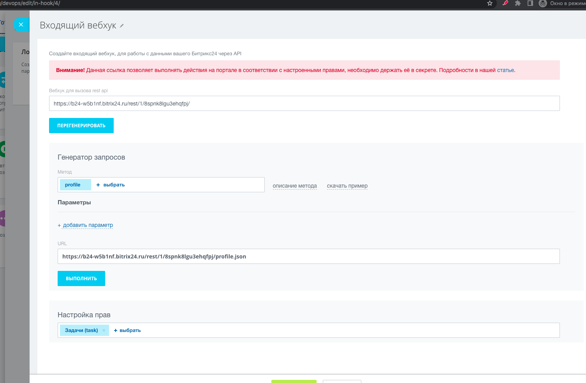
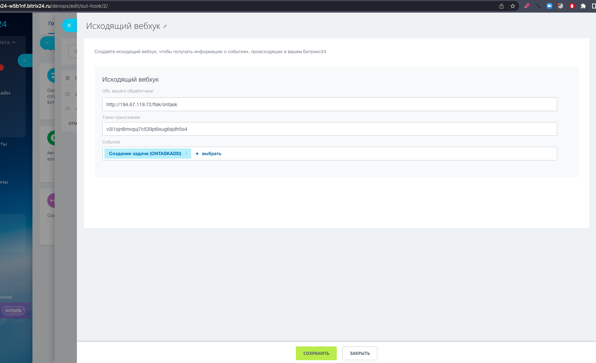

# Fastapi_with_flask

Адрес портала для тестов https://b24-w5b1nf.bitrix24.ru/

Видео тестов -> 

<video src="Дэмо.mp4"></video>


 

## Установка

- Клонируем репозиторий

  ```bash
  git clone https://github.com/ilyailyushko/fastapi_with_flask.git
  ```

- Устанавливаем fastapi и uvicorn

  ```bash
  pip install fastapi
  pip install "uvicorn[standard]"
  ```

- Устанавливаем flask

  ```bash
  pip install Flask
  ```

-  Устанавливаем библиотеку для работы с б24

  ```
  pip install fast-bitrix24
  ```

  

## Запуск

```
uvicorn main:app --host {IP_АДРЕС} --port 80 --reload
```

*Если не нужна перезагрузка при изменении файлов, снять флаг `--reload`*


## Подготовка на стороне б24 

- Создать входящий вебхук, выписать права на `Задачи(task)`

  

- Создать иходящий вебхук, настроить подписку на события: 

  - `Создание задачи`
  



